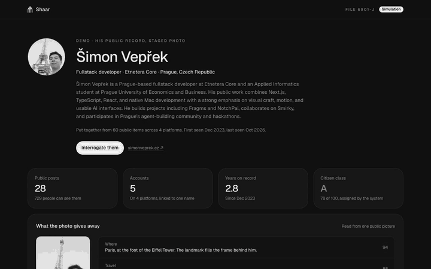

<p align="center">
  
</p>

<h1 align="center">Shaar</h1>
<p align="center"><b>Beware the Spectator.</b></p>

<p align="center">
  Type a name. Shaar finds every public account behind it, reads them, files the person the way a watcher
  would, and lets you question a voice simulation of them.
</p>

<p align="center">
  Built on <a href="https://apify.com"><b>Apify</b></a> and <a href="https://elevenlabs.io"><b>ElevenLabs</b></a>,
  with OpenAI for reading and searching.
</p>

<p align="center">
  <a href="https://github.com/simonveprek/projstalker/actions/workflows/ci.yml"></a>
  
  
  
</p>

---

Shaar is a simulation of what an oppressive government, or anyone patient enough, could put together about an
ordinary person from what they chose to make public. It is built to make that visible. Everything it shows
comes from public sources, and every file and every voice is labelled as a simulation.

It was built at **From Dusk Till Dawn**, the overnight hackathon by Agents 0.0.7 in Prague, on topic 01,
Social Media Deep Research.

## Thank you, Apify and ElevenLabs

Shaar is two products wearing one interface. Without them it would be a text box.

**[Apify](https://apify.com) is how Shaar sees.** Every account, post, profile picture and website page in a
file comes out of an Apify Actor. Shaar runs 15 different Actors from the Apify Store across Instagram,
TikTok, X, LinkedIn, YouTube, Facebook, Reddit, Threads, Pinterest, Google Search and the open web, starts them
in parallel, caps what each may spend, and reads their datasets while they are still filling up, so you watch
a person's records arrive one by one. Finding someone from just a name is two Apify runs. Filing them is up to
a dozen more.

**[ElevenLabs](https://elevenlabs.io) is how Shaar speaks.** Every file ends in a room where you can question
the person. Shaar creates an ElevenLabs Conversational AI agent for each persona, gives it a voice matched to
the person's age and gender, writes its system prompt from everything that was read, and connects your
browser to it over WebRTC. The agent answers in the first person, in the person's tone, about their real
projects and views. When the call ends, ElevenLabs sends the transcript back to Shaar.

Both teams built platforms that let a small team ship something this complete in one night. Thank you.

## See it

Recorded from `/demo/simon`, which stages the whole flow for one of us from his real public record.

**1. Find.** The name types itself in, you say what you are here for, and the search fans out across ten sites
at once. What comes back is sieved down to the accounts that are really them, including a second Instagram that
Google never returns.

<p align="center"></p>

**2. Collect.** Every source fills in record by record as Apify finds them. LinkedIn and GitHub were never
searched for: they were found through his website.

<p align="center"></p>

**3. The file.** Who he is, where his photo was taken, his work and schooling, his website, what the web says about
him, his code, when he is online and his citizen class.

<p align="center"></p>

**4. Interrogate.** One button, and an ElevenLabs agent speaking as him, labelled a simulation.

<p align="center"></p>

## Contents

- [What it does](#what-it-does)
- [How Apify is used](#how-apify-is-used)
- [How ElevenLabs is used](#how-elevenlabs-is-used)
- [How OpenAI is used](#how-openai-is-used)
- [The file](#the-file)
- [Demos](#demos)
- [Getting started](#getting-started)
- [Configuration](#configuration)
- [API](#api)
- [CI/CD](#cicd)
- [Architecture](#architecture)
- [Project structure](#project-structure)
- [Design](#design)
- [Responsible use](#responsible-use)
- [Team](#team)

## What it does

```
 Who are we looking for?
        │
        ▼
 1. FIND        Google per platform ─┐
                Instagram handles   ─┼─► candidate accounts ─► you confirm which are them
                ChatGPT web search  ─┘
        │
        ▼
 2. COLLECT     an Apify Actor per account (profiles, posts, pages)
                GitHub public API
                ChatGPT web search with what is already known
                + every account their own site or bios link to, followed automatically
        │
        ▼
 3. READ        OpenAI turns everything into a persona: facts with sources, opinions with evidence,
                how they talk, a timeline, and how their voice should sound
        │
        ▼
 4. FILE        the dossier: who they are, when they are online, where, who with, what the web says,
                what their photo gives away, and the class the system files them under
        │
        ▼
 5. INTERROGATE an ElevenLabs agent that speaks as them, in your browser, by voice
```

1. **Find.** You type a name and say what you are here for. Three searches run side by side: a Google search
   per platform, a lookup of the Instagram handles a person with that name would pick (`simonveprek`,
   `simon.veprek`, `veprek_simon`, and so on), and a ChatGPT web search for their accounts. You see the accounts
   it found and confirm which are really them, because names are shared.
2. **Collect.** Each confirmed account starts its platform's Apify Actors. Their own website is crawled and its
   structured data read. GitHub comes from its public API. A ChatGPT web search, told what is already known,
   brings pages about them from elsewhere. Any account linked from their website, their bios or a confident web
   search is followed and read too, so one website can lead to their LinkedIn, GitHub and second Instagram.
3. **Read.** When every source is in, OpenAI reads all of it and writes a structured persona.
4. **File.** The dossier fills in as sources arrive.
5. **Interrogate.** One button opens a call with the persona.

## How Apify is used

Apify does all of the scraping. Shaar never touches a platform directly; it starts Actors, waits for them
without blocking anything, and turns their datasets into one shape.

### Actors

| Platform | Actor | What Shaar takes from it |
| --- | --- | --- |
| Discovery | [`apify/google-search-scraper`](https://apify.com/apify/google-search-scraper) | One search per platform for the name in quotes (`"Jane Doe" site:instagram.com`), plus one open search for their own website, all in a single run |
| Discovery | [`apify/instagram-profile-scraper`](https://apify.com/apify/instagram-profile-scraper) | The Instagram handles a person with that name would pick, looked up in one run. This is how second accounts turn up that never rank on Google |
| Instagram | [`apify/instagram-profile-scraper`](https://apify.com/apify/instagram-profile-scraper) | Bio, followers, profile picture, links in bio, whether the account is private |
| Instagram | [`apify/instagram-scraper`](https://apify.com/apify/instagram-scraper) | Posts with captions, times, likes and comments |
| TikTok | [`clockworks/tiktok-profile-scraper`](https://apify.com/clockworks/tiktok-profile-scraper) | Profile, bio link and videos with captions and play counts |
| X | [`apidojo/twitter-user-scraper`](https://apify.com/apidojo/twitter-user-scraper) | Profile and followers |
| X | [`apidojo/twitter-scraper-lite`](https://apify.com/apidojo/twitter-scraper-lite) | Tweets with times and engagement |
| LinkedIn | [`harvestapi/linkedin-profile-scraper`](https://apify.com/harvestapi/linkedin-profile-scraper) | Headline, location, full work history and schooling with dates |
| LinkedIn | [`harvestapi/linkedin-profile-posts`](https://apify.com/harvestapi/linkedin-profile-posts) | Posts with reactions, comments and reposts |
| YouTube | [`streamers/youtube-scraper`](https://apify.com/streamers/youtube-scraper) | Channel and videos with views |
| Facebook | [`apify/facebook-pages-scraper`](https://apify.com/apify/facebook-pages-scraper) | Page profile and links |
| Facebook | [`apify/facebook-posts-scraper`](https://apify.com/apify/facebook-posts-scraper) | Posts |
| Reddit | [`trudax/reddit-scraper-lite`](https://apify.com/trudax/reddit-scraper-lite) | A user's posts and comments with scores |
| Threads | [`futurizerush/meta-threads-scraper`](https://apify.com/futurizerush/meta-threads-scraper) | Profile and threads |
| Pinterest | [`automation-lab/pinterest-scraper`](https://apify.com/automation-lab/pinterest-scraper) | Profile and pins |
| Their website | [`apify/website-content-crawler`](https://apify.com/apify/website-content-crawler) | Up to 12 pages as text, the links in their footer, and the page's JSON-LD: job title, employer, city, skills, projects and the other profiles the site says are theirs |

Each platform is one file in [`src/connectors/`](src/connectors). A connector says which Actors to run, how to
turn a handle or URL into each Actor's input, and how to normalize each dataset item into a profile, post,
comment or page. The raw item is kept beside the normalized one.

### How runs are handled

- **Started in parallel, never awaited.** `POST /api/research` starts every Actor with `actor.start()` and
  returns at once. A run takes from seconds to minutes; no request waits for one, so the app also fits a
  serverless 60 second limit.
- **Moved forward from outside.** An Apify webhook (`ACTOR.RUN.SUCCEEDED`, `FAILED`, `ABORTED`, `TIMED_OUT`) or
  the page polling `GET /api/research/:id/dossier` calls `advanceJob`, which checks every run, ingests the
  finished ones and starts the next step. Locally, without a public URL for webhooks, polling alone is enough.
- **Ingested exactly once.** A finished run is claimed with a conditional update (`running → ingesting`) so a
  webhook and a poll can never both read its dataset. Partial datasets from runs that hit their cost cap or
  timeout are kept.
- **Live counts.** While a run is still going, its dataset's `itemCount` is read on every poll, so the
  collecting screen shows records as Apify finds them, not only when a run ends.
- **Bounded.** Every run gets `maxItems` and `maxTotalChargeUsd` (`APIFY_MAX_CHARGE_USD_PER_RUN`, default $1).
  Actors whose default memory is far above their need get less: the website crawler runs in 1 GB instead of
  8 GB, so it does not take a whole free plan's memory.
- **Queued, not failed, on plan limits.** When the plan has no free concurrent run or memory, the run stays
  queued with a short lease and starts on a later poll.
- **Followed.** When a profile or page lands, the links in it are checked (see
  [`src/lib/follow.ts`](src/lib/follow.ts)). A link in a bio, one the site declares as its owner's in JSON-LD,
  or one a web search is sure of starts that platform's Actors in the same job. A plain link on their site only
  counts when the handle spells their name, since sites link to friends and clients. At most two accounts per
  platform and six followed accounts per job. A partial unique index keeps two pollers from starting the same
  run twice.

What it costs in practice: the Instagram handle lookup for one name (12 handles) ran in 28 seconds for about
$0.03. A full file is usually well under a dollar.

## How ElevenLabs is used

ElevenLabs runs every conversation. Shaar never handles audio itself.

### One agent per persona

When someone first opens the room, [`src/lib/elevenlabs.ts`](src/lib/elevenlabs.ts) creates a private
**Conversational AI agent** for that persona (`POST /v1/convai/agents/create`) and stores its id. Before each
call the agent is updated (`PATCH /v1/convai/agents/:id`), so changes to the prompt reach older agents too.
The agent has authentication on, so only Shaar can start sessions with it.

### The prompt

The system prompt is written from the persona: who they are, how they talk (tone, vocabulary, humour,
sentence length, phrases they use), what they care about, their opinions and the facts on record, and what
to avoid. It opens with a fixed block that always holds:

- speak **as the person, in the first person** ("I", "my work"), never about them in the third person, never
  as "a persona" or "a character";
- answer from their real projects, work and views, and deflect what their public record does not cover
  instead of inventing it;
- if sincerely asked whether this is really them, say it is **an AI simulation built from public posts**, then
  carry on. It never claims to be the real person.

The opening line is the persona's own first sentence, in their voice.

### Voices

Every persona gets a stock ElevenLabs voice matched to how they present publicly, so no one's voice is cloned:

| | young | middle aged | old |
| --- | --- | --- | --- |
| male | Will | Chris | Bill |
| female | Jessica | Bella | Alice |

Gender and age come from the persona; `ELEVENLABS_DEFAULT_VOICE_ID` or Bella covers the rest. The frontend can
pass any `voiceId`. Speech uses `ELEVENLABS_TTS_MODEL` (default `eleven_v4_turbo`), and the agent thinks with
`ELEVENLABS_AGENT_LLM`.

### The call

1. The room calls `POST /api/personas/:id/interviews`. The server syncs the agent and asks ElevenLabs for a
   **WebRTC conversation token** (`GET /v1/convai/conversation/token`), or a signed WebSocket URL if asked.
2. The browser passes the token to `useConversation().startSession()` from
   [`@elevenlabs/react`](https://www.npmjs.com/package/@elevenlabs/react), inside the `MeetCall` component: a
   lobby, live captions, mic and camera controls and hang up.
3. Audio flows directly between the browser and ElevenLabs. Shaar is not in the audio path.
4. When the call ends, ElevenLabs' **post-call webhook** (`POST /api/webhooks/elevenlabs`, verified with
   HMAC-SHA256 over `t.body` and a 30 minute window) delivers the transcript and analysis. If the webhook is
   not set up, `GET /api/interviews/:id` pulls the conversation from ElevenLabs instead.

### The practice interviewer

The same agents also power a job interview simulator (fictional candidates in
[`fixtures/candidates`](fixtures/candidates)). There the agent plays a candidate interviewed by HR, reports how
it feels through a silent **client tool** (`reportFeeling`, handled in the browser), reads its difficulty from
a **dynamic variable**, and calls are capped at 15 minutes. Afterwards OpenAI writes the candidate's feedback
from the transcript. See [`docs/interview-simulator-agent-guide.md`](docs/interview-simulator-agent-guide.md).

`POST /api/voice/tts` also exposes plain ElevenLabs text to speech, streamed as `audio/mpeg`.

## How OpenAI is used

- **The persona.** All collected items become a digest (profiles, website pages with their structured facts,
  repositories, public activity, posts, pages about them). A model with strict structured outputs turns it
  into a `PersonaProfile`: summary, demographics, traits, interests, opinions with quoted evidence, facts with
  sources and confidence, a timeline, communication style, topics to avoid, the voice, and the agent's
  instructions. It runs in **background mode**: the response id is stored and polled, so nothing waits.
- **ChatGPT web search.** A model with the `web_search` tool, also in background mode, searches the open web for
  the person. In discovery it looks for accounts. In a file it is told the confirmed profiles, so namesakes stay
  out, and returns pages that name them (talks, events, articles, team pages) and facts with their sources.
  Their own profiles are never counted as mentions.
- **Candidate feedback** after a practice interview, with every quote checked against the transcript.

Without an OpenAI key, a file is still complete; it just has no persona, web search or call.

## The file

`/dossier/:id` fills in while sources are collecting, then shows:

| Section | From |
| --- | --- |
| Name, photo, one line of who they are, summary | Their profiles, the persona |
| Citizen class, S to F | How legible they are to the system: identity, routine, record, reach and how often they are named elsewhere. A satire of social scoring: it measures what a watcher has, never the person |
| Who they are | Job, employer, city, languages, work history and schooling, each with its source |
| Their story | A dated timeline |
| What the photo gives away | Where and when a public photo was taken, read from it (staged in the demo) |
| Their website | What it says, their projects, the pages read |
| What they work with | Skills they list, languages in their code |
| On the web, what the web says | Pages that name them and facts with sources, from the web search |
| What they build | Their GitHub repositories |
| When they are online | Every timestamped post and push by weekday and hour |
| How much they post, seen on, their circle | Activity by month, every account, who they mention most |
| In their own words, what they said they think | Their most seen posts, their stated views with evidence |

## Demos

| URL | What |
| --- | --- |
| `/demo` | The whole flow with **Mara Vell**, a fictional photographer. No API calls; ends in a real ElevenLabs conversation with her |
| `/demo/simon` | The whole flow for **Šimon Vepřek**, staged from a real run on his public record (website, GitHub, LinkedIn, both Instagrams, the web search), with a staged photo |
| `/dossier/sample` | The fictional sample file on its own |
| `/docs` | The design system and the full API reference |

## Getting started

Requirements: Node 20 or newer.

```bash
npm install
```

```bash
cp .env.example .env.local
```

Add `APIFY_TOKEN` to `.env.local`. That is enough to find and file someone. Add `OPENAI_API_KEY` for the
persona and web search, and `ELEVENLABS_API_KEY` for the calls.

```bash
npm run dev
```

Open http://localhost:4000. The database is created in `.data/shaar` on first use; delete `.data` to start
from empty.

| Script | What it does |
| --- | --- |
| `npm run dev` | Development server on port 4000 |
| `npm run build`, `npm start` | Production build and server |
| `npm run typecheck` | Route types and TypeScript |
| `npm run lint` | ESLint |
| `npm test` | The test suite: following links, finding accounts, every connector's normalizer, the file and the agent's prompt. Pure functions, no network or keys |
| `npm run seed:candidates` | The fictional practice candidates, for the interview simulator |
| `npm run try:agent -- alex-novak` | Try a practice candidate as an ElevenLabs agent with only an ElevenLabs key, then talk to it in the ElevenLabs dashboard |

## Configuration

Every key is optional; each feature says plainly when the key it needs is missing.

| Variable | For |
| --- | --- |
| `APIFY_TOKEN` | Everything that searches or scrapes |
| `APIFY_MAX_CHARGE_USD_PER_RUN` | Spending cap per Actor run, default 1 |
| `APIFY_WEBHOOK_SECRET` | Guards `/api/webhooks/apify`, only with `PUBLIC_API_URL` |
| `PUBLIC_API_URL` | Public URL of this app, enables Apify webhooks. Leave empty locally |
| `OPENAI_API_KEY` | Persona, web search, candidate feedback |
| `OPENAI_PERSONA_MODEL`, `OPENAI_CHAT_MODEL`, `OPENAI_SEARCH_MODEL`, `OPENAI_FEEDBACK_MODEL` | Which model does what |
| `ELEVENLABS_API_KEY` | Agents, calls, text to speech |
| `ELEVENLABS_DEFAULT_VOICE_ID` | Voice when a persona gives no gender |
| `ELEVENLABS_AGENT_LLM`, `ELEVENLABS_TTS_MODEL` | The agent's language model and speech model |
| `ELEVENLABS_WEBHOOK_SECRET` | Verifies the post-call webhook |
| `GITHUB_TOKEN` | Raises GitHub's public API limit from 60 to 5,000 requests an hour |
| `DATA_DIR`, `VISITOR_SECRET` | Where the database lives, and what signs the visitor cookie |

## API

Visitors never sign up. The first search gives them a random id in a signed httpOnly `shaar_visitor` cookie,
and everything they make is theirs alone. The live reference is at `/docs` and `GET /api`; the lifecycle, data
model and rules for contributors are in [`be.md`](be.md).

| Method | Route | Purpose |
| --- | --- | --- |
| POST | `/api/discover` | Find a name's accounts: `{ name, purpose? }` |
| GET | `/api/discover/:id` | Poll until `ready`, then confirm candidates |
| POST | `/api/research` | Start a file: `{ subjectName, notes?, targets: [{ platform, target }] }` |
| GET | `/api/research` | My files |
| GET | `/api/research/:id` | Job, runs, persona, counts |
| GET | `/api/research/:id/dossier` | The file, per-source progress, and the persona once ready. Polling it moves the job forward |
| GET | `/api/research/:id/photo` | Their profile picture, through Shaar, cached |
| GET | `/api/research/:id/items` | Raw collected items |
| POST | `/api/research/:id/persona` | Read them again |
| DELETE | `/api/research/:id` | Delete a file and its data |
| GET, POST | `/api/connectors`, `/api/connectors/:platform` | Platforms, and adding one source to a file |
| GET | `/api/personas/:id` | A persona |
| POST | `/api/personas/:id/interviews` | Start a call: returns the ElevenLabs session for the browser |
| GET | `/api/interviews/:id` | Transcript, analysis, feedback |
| POST | `/api/interviews/:id/feelings`, `/api/interviews/:id/feedback` | Practice interview mood and feedback |
| POST | `/api/demo/persona` | A demo persona for this visitor: `{ who: "mara" \| "simon" }` |
| POST | `/api/ai/chat` | Streamed chat, grounded in a file with `jobId` |
| POST | `/api/voice/tts` | ElevenLabs text to speech |
| POST | `/api/webhooks/apify`, `/api/webhooks/elevenlabs` | Run finished, call finished |

## CI/CD

GitHub Actions, in [`.github/workflows`](.github/workflows):

- **CI** ([`ci.yml`](.github/workflows/ci.yml)) runs on every push to `main` and every pull request: `npm ci`,
  typecheck, lint, the test suite and a production build, on Node 22 with the npm and Next.js caches. No secrets
  are needed: every service is optional at build time and the tests are pure.
- **Release** ([`release.yml`](.github/workflows/release.yml)) runs on a version tag. It runs the whole CI first,
  then publishes a GitHub release with notes generated from the commits and the source as an archive. Shaar runs
  on localhost, so a release is what people download and run.

```bash
git tag v1.0.0 && git push origin v1.0.0
```

## Architecture

- **Next.js 16** (App Router, React 19) serves the pages and the API from one app.
- **PGlite**, Postgres in the process, stored in `.data/shaar`. No database to run.
- **Nothing blocks.** Apify runs, OpenAI responses and ElevenLabs calls all happen elsewhere; the app only
  starts them and moves state forward when it hears back or is polled. Every step is an idempotent, conditional
  state change, so webhooks and pollers can race safely.
- **One shape for every source.** Connectors normalize into `scraped_items` (`profile`, `post`, `comment`,
  `page`, `repo`, `activity`, `mention`), with `links` they published and `details` they state outright.
- **Pure where it matters.** Building the file (`buildDossier`) and deciding what to follow (`linksToFollow`)
  are pure functions over stored items, so they are easy to test and racing pollers agree.

```
research_jobs ─┬─ connector_runs (one per Actor, with apify_run_id, followed_from)
               ├─ scraped_items  (normalized, raw kept)
               └─ personas ── interviews (ElevenLabs conversation, transcript, feedback)
discoveries (Google run, Instagram handle run, web search, candidates)
```

## Project structure

```
src/
  app/
    landing.tsx, searching.tsx    the opening, the name, the search, confirming accounts
    dossier/                       the file, the collecting screen
    interview/                     the call room
    demo/, demos.ts                the staged demos
    api/                           every route
  connectors/                      one file per platform: Actors, inputs, normalizers, link parsing
  lib/
    research.ts                    the job lifecycle: start, poll, ingest, follow, read
    discovery.ts                   finding accounts from a name
    follow.ts                      which linked accounts to follow
    web-search.ts                  ChatGPT web search
    persona.ts                     the persona schema, digest and agent prompt
    elevenlabs.ts, interviews.ts   agents, sessions, transcripts
    voices.ts                      stock voice selection
    dossier.ts                     building the file
  components/
    ui, fragms                     the Fragms design system
    meet/MeetCall.tsx              the call UI on @elevenlabs/react
fixtures/                          fictional candidates, Mara Vell, the Šimon demo snapshot
docs/                              interview simulator guides
```

## Design

Shaar uses **Fragms Personal**, a design system vendored in `src/components/ui` and `src/components/fragms`.
Monochrome, dark, quiet: one cold glow under the gate on the opening screen, motion that opens in 250 ms and
closes in 150 ms, and a single signal colour reserved for what the system flags. No monospace type in the
product. Every screen works at 375 px wide. See [`AGENTS.md`](AGENTS.md) for the rules.

## Responsible use

- **Public data only.** Shaar reads what anyone can open without logging in. Private accounts stay private and
  are marked as such. The prompts forbid inferring health, family, sexuality, religion, finances or addresses.
- **Always labelled a simulation.** Every file and every call says so, and the agent says it is an AI simulation
  whenever sincerely asked.
- **No cloned voices.** Personas speak with stock ElevenLabs voices. Do not clone a real person's voice without
  their consent.
- **The point is the warning.** Shaar shows how little it takes. Use it on yourself, or with the consent of the
  person you look up. Under the GDPR, building a profile of a real person is processing their personal data,
  even when every source is public.

## Team

Built by **Šimon Vepřek**, **Nhat Minh Duong** and **Michael Ptáček** in Prague, with Claude Code.

With thanks to **Apify** and **ElevenLabs**, whose platforms do the seeing and the speaking, and to Agents 0.0.7
for the night.
